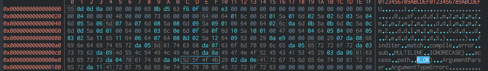

# Seek
This is my first ChatGPT inspired project! I wanted to create something to find hex, strings, or regex patterns in files. And also return the min:max depth of the found patterns. I thought it would be really helpful in writing yara rules.

I'm also pretty reasonable. If you open an issue to add the feature to support different types of hex, i'll add it. I just normally use hex streams as hex patterns instead of de:ad:be:ef or de ad be ef.
 * [Usage](#usage)
 * [Installation](#installation)
 * [ChatGPT Prompts](#prompts)

# Usage
[Hex Search](#hex-search) [Regex Search](#regex-search) [String Search](#string-search) [Class Import](#class-import)
```bash
./seek.py --help
usage: seek.py [-h] -f FILE [-s STRING] [--hex HEX] [-r REGEX] [-m] [--nocase] [--min MIN] [--max MAX]

optional arguments:
  -h, --help            show this help message and exit
  -f FILE, --file FILE  input file
  -s STRING, --string STRING
                        search string
  --hex HEX             search for a hex pattern
  -r REGEX, --regex REGEX
                        search for a regular expression pattern
  -m, --multiline       Regex option for multiline searching
  --nocase              Regex option for ignorecase aka nocase
  --min MIN, --min-depth MIN
                        Minimum depth to read in a file
  --max MAX, --max-depth MAX
                        Maximum depth to read in a file
```



## Hex Search
```bash
$ ./seek.py -f sample.bytes --hex 525f4f4b
# PATTERN: b'R_OK'
# MATCHES: 1
# OFFSETS: [[236, 240]]
# MIN    : MAX      -- CONTENT[min-20]:CONTENT[max+20]
# 236    : 240      -- SE)\x03\xda\x06access\xda\x04path\xda\x04R_OK)\x02\xda\x0eArgumentParser\xda\x11
```

## Regex Search
```bash
./seek.py -f sample.bytes --regex [A-Z]\_OK
# PATTERN: re.compile(b'[A-Z]_OK')
# MATCHES: 1
# OFFSETS: [[236, 240]]
# MIN    : MAX      -- CONTENT[min-20]:CONTENT[max+20]
# 236    : 240      -- SE)\x03\xda\x06access\xda\x04path\xda\x04R_OK)\x02\xda\x0eArgumentParser\xda\x11
```

## String Search
```bash
./seek.py -f sample.bytes --string R_OK
# PATTERN: b'R_OK'
# MATCHES: 1
# OFFSETS: [[236, 240]]
# MIN    : MAX      -- CONTENT[min-20]:CONTENT[max+20]
# 236    : 240      -- SE)\x03\xda\x06access\xda\x04path\xda\x04R_OK)\x02\xda\x0eArgumentParser\xda\x11
```
# Prompts
Below are the prompts I used for the project. I'm still new to ChatGPT, so it was alot of learning to how to describe what I wanted. The prompts are honestly really large so i'm going to link in sepearte files for this. See the markdown files linked:

  * [Command Line Arguments](prompts/cliarguments.md)
  * [Class Creation](prompts/createclass.md)
  * [Setup Script](prompts/installation.md)
